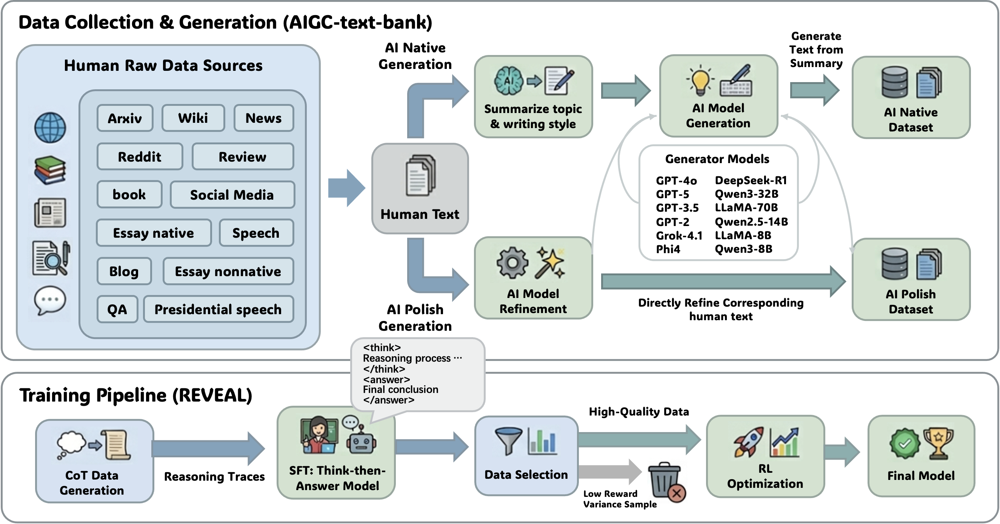

<div align="center">

# 🔍 Reasoning-Aware AIGC Detection via Alignment and Reinforcement

**REVEAL is a reasoning-driven framework that shifts AIGC detection from opaque classification to transparent, interpretable, chain-of-thought analysis.**

</div>

---

## 📑 Table of Contents

- [🔍 Reasoning-Aware AIGC Detection via Alignment and Reinforcement](#-reasoning-aware-aigc-detection-via-alignment-and-reinforcement)
  - [📑 Table of Contents](#-table-of-contents)
  - [✨ Overview](#-overview)
  - [🚀 Installation](#-installation)
    - [Prerequisites](#prerequisites)
    - [Environment Setup](#environment-setup)
  - [💻 Usage](#-usage)
    - [1. Quick Start](#1-quick-start)
    - [2. Model Training](#2-model-training)
    - [3. Dataset Build](#3-dataset-build)
    - [📝 Citation](#-citation)
  - [📄 Contact](#-contact)

---

## ✨ Overview

The rapid advancement of Large Language Models (LLMs) has made AI-generated content (AIGC) increasingly indistinguishable from human writing. Existing detectors often rely on opaque black-box classifiers that struggle to generalize and fail to provide interpretable evidence, especially in nuanced scenarios like human-AI collaborative writing.

To address this, we introduce two core contributions:

1. **AIGC-text-bank**: A large-scale, multi-domain dataset covering 10 domains and generated using 12 LLMs. It features parallel documents across three categories: **Human**, **AI-Native**, and **AI-Polish** (human text refined by AI).
2. **REVEAL**: A novel detection framework built on the *Think-then-Answer* paradigm. It is trained via **Supervised Fine-Tuning (SFT)** to initialize reasoning capabilities, followed by **Reinforcement Learning (RL)** to refine reasoning chains, improve logical consistency, and reduce hallucinations.

<div align="center">
  
</div>

---

## 🚀 Installation

### Prerequisites
- Python 3.13+
- CUDA 12.x (Recommended)

### Environment Setup

```bash
# 1. Create and activate conda environment
conda create -n reveal python=3.13.11
conda activate reveal

# 2. Install vLLM
pip install vllm==0.11.0

# 3. Install Requirements
pip install -e .

# 4. Install Flash Attention 2
pip install flash-attn==2.8.3 --no-build-isolation

# 5. Install W&B
pip install wandb
wandb login
```

---

## 💻 Usage

### 1. Quick Start

You can directly load our pre-trained models to run AIGC detection on your own text. We provide a simple Python script for single-text inference.

**Mode A: REVEAL (Standard Reasoning Mode)**  
The default *Think-then-Answer* mode. The model explicitly generates a transparent reasoning chain (`<think>...</think>`) before outputting the final verdict.
```bash
# 2-class detection
python inference/think.py \
    --model_path "bmbgsj/REVEAL_think_2class" \
    --text "Input the text you want to detect here..."

# 3-class detection
python inference/think.py \
    --model_path "bmbgsj/REVEAL_think_3class" \
    --text "Input the text you want to detect here..."
```

**Mode B: REVEAL-Fast (Direct Scoring)**  
Designed for fast, block-wise scanning. It bypasses the reasoning generation and outputs the classification directly, alongside a continuous **AIGC Score (0.0 to 1.0)** for fine-grained confidence estimation.
```bash
# 2-class detection
python inference/fast.py \
    --model_path "bmbgsj/REVEAL_fast_2class" \
    --text "Input the text you want to detect here..."

# 3-class detection
python inference/fast.py \
    --model_path "bmbgsj/REVEAL_fast_3class" \
    --text "Input the text you want to detect here..."
```

### 2. Model Training

You can train the model from scratch following our two-stage pipeline. 

```bash
export OPENAI_API_KEY="sk-your-api-key-here"

# Prepare: Download and split the dataset
bash scripts/data.sh

# Stage 1: Supervised Fine-Tuning (SFT)
# Initializes the model with structured reasoning trajectories.
bash scripts/sft.sh

# Stage 2: Reinforcement Learning (RL)
# Optimizes reasoning consistency and classification accuracy.
bash scripts/rl.sh
```

### 3. Dataset Build

Follow these steps only if you wish to reproduce our data construction pipeline or synthesize a custom AIGC-text-bank from scratch.

**Step 3.1: Prepare Human Data**  
Place your raw human-written corpus into `data/aigc-text-bank/human_data/human_data.jsonl`. Ensure the data format strictly follows the structure provided in `aigc-text-bank/human_data_sample.jsonl`.

**Step 3.2: Generate AI Text**  
Synthesize the corresponding AI-generated counterparts based on your human data. For security and simplicity, export your API key as an environment variable first:

```bash
# Export your API key
export OPENAI_API_KEY="sk-your-api-key-here"

# 1. Generate AI-Native Data (Summarization Step)
python aigc-text-bank/ai_native/summary.py \
    --input_file "data/aigc-text-bank/human_data/human_data.jsonl" \
    --output_file "data/aigc-text-bank/ai_native/ai_summary/ai_summary.jsonl" \
    --model_name "gpt-4o" \
    --base_url "https://api.openai.com/v1"

# 2. Generate AI-Native Data (Generation Step)
python aigc-text-bank/ai_native/generate.py \
    --summary_file "data/aigc-text-bank/ai_native/ai_summary/ai_summary.jsonl" \
    --human_file "data/aigc-text-bank/human_data/human_data.jsonl" \
    --output_file "data/aigc-text-bank/ai_native/ai_data/gpt-4o.jsonl" \
    --model_name "gpt-4o" \
    --base_url "https://api.openai.com/v1"

# 3. Generate AI-Polish Data (Refining Human Text)
python aigc-text-bank/ai_polish/polish.py \
    --input_file "data/aigc-text-bank/human_data/human_data.jsonl" \
    --output_file "data/aigc-text-bank/ai_polish/gpt-4o.jsonl" \
    --model_name "gpt-4o" \
    --base_url "https://api.openai.com/v1"
```

## 📝 Citation

If you find our paper, dataset, or code useful, please consider citing our work:

```bibtex
@misc{wang2026reasoningawareaigcdetectionalignment,
      title={Reasoning-Aware AIGC Detection via Alignment and Reinforcement}, 
      author={Zhao Wang and Max Xiong and Jianxun Lian and Zhicheng Dou},
      year={2026},
      eprint={2604.19172},
      archivePrefix={arXiv},
      primaryClass={cs.AI},
      url={https://arxiv.org/abs/2604.19172}, 
}
```

---

## 📄 Contact

if you have any questions about the paper, or want to access the datasets/models, please contact us at [lilin22wz@gmail.com](mailto:lilin22wz@gmail.com).
